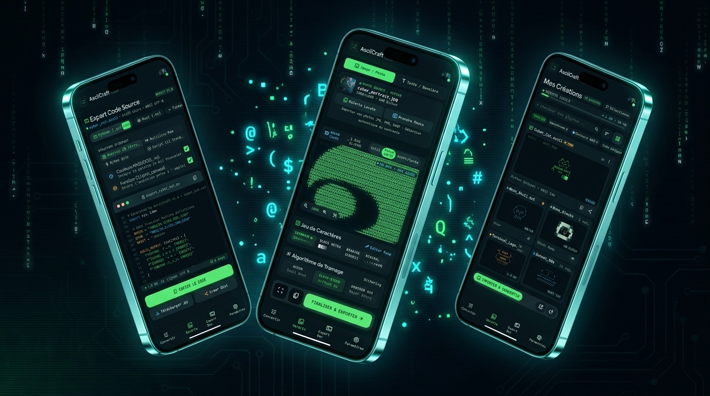

# AsciiArt — Studio de Création & Convertisseur ASCII Art

[](https://kotlinlang.org)
[](https://developer.android.com/jetpack/compose)
[](https://developer.android.com/training/data-storage/room)
[](https://kotlinlang.org/docs/coroutines-overview.html)
[](https://opensource.org/licenses/Apache-2.0)

<p align="center">
  
</p>

> **AsciiArt** est une application mobile Android moderne en mode sombre conçue pour convertir des photos personnelles ou du texte en **ASCII Art haute fidélité**. L'application s'adresse à la fois au grand public (partage visuel sur réseaux sociaux, enregistrement HD local) et aux développeurs (export en code source multi-langages pour CLI, scripts et bannières de terminaux).

---

## 📸 Aperçu & Captures d'Écran

> Placez vos captures d'écran dans le dossier `docs/screenshots/` avec les noms indiqués ci-dessous pour les afficher automatiquement sur GitHub.

| **1. Studio de Conversion** | **2. DevKit Multi-Langages** | **3. Galerie & Inspirations** | **4. Export Graphique & Partage** |
| :---: | :---: | :---: | :---: |
|  |  |  |  |
| *Conversion Image & FIGlet en temps réel* | *Génération Python, Rust, TS, Go, C++* | *Historique SQLite & Modèles prêts à l'emploi* | *Rendu HD CRT/OLED & Partage Social* |

---

## 1. Fonctionnalités Clés

- 🖼️ **Conversion d'Images Haute Définition** : Traitement d'images JPG, PNG, WebP avec échantillonnage de luminance Rec. 709, tramage avancé (Floyd-Steinberg 2D & Bayer 4x4) et calibrage dynamique de contraste/gamma.
- 🔤 **Générateur Typographique FIGlet** : Moteur de rendu de bannières textuelles ASCII en temps réel avec sélection de polices (Standard, Slant, Banner, Doom, Monospace 3D).
- 🎨 **Palette Chromatique Terminal Cyber-Craft** : Support des modes Vert Phosphore (VT220), Ambre Vintage (IBM 3270), Truecolor ANSI 24-bit et Cyberpunk Néon (Cyan & Magenta).
- 🛠️ **DevKit d'Export Multi-Langages** : Génération instantanée de code source sans dépendance externe pour :
  - **Python** (`.py` 3.11+) : Matrice 2D, Multiline raw, Buffer gzip et fonction CLI `print_canvas()`
  - **Rust** (`.rs` 1.75+) : Constante `&[&str]` ou `&str` brute avec macro d'affichage
  - **TypeScript** (`.ts` 5.0+) : Tableaux `readonly` typés pour Node.js / Deno / Bun
  - **Go** (`.go` 1.21+) : Slices et chaînes littérales
  - **C++** (`.cpp` 20) : Vecteurs `std::vector<std::string>` et flux `std::cout`
- 📱 **Partage Social & 1-Tap Copy** : Formats adaptés pour Discord (blocs Markdown ` ``` `), WhatsApp, Instagram Bio et X / Twitter.
- 📸 **Export Graphique HD** : Rendu de fonds immersifs (OLED, CRT Scanlines, PNG Alpha, Halo Cyberpunk) sauvegardé dans la galerie Photos Android.
- 💾 **Galerie Locale & Bibliothèque d'Inspiration** : 
  - **Mes Créations (Room SQLite)** : Historique complet des créations personnelles hors-ligne avec favoris, indicateur de stockage et filtres thématiques.
  - **Bibliothèque de Modèles & Inspiration** : Catalogue riche de modèles prêts à l'emploi (Image-to-ASCII et FIGlet Text-to-ASCII : Cyberpunk, Rétro 8-bit, Bannières, Binaire, Mecha...) chargeables en 1 clic directement dans le Studio.

---

## 2. Architecture & Pipeline Asynchrone

- **UI Réactive** : [Jetpack Compose](https://developer.android.com/jetpack/compose) avec Material Design 3 personnalisé (*Terminal Cyber-Craft OLED*).
- **Moteur Asynchrone (Kotlin Coroutines & Flow)** : 
  - Traitement d'image et tramage matriciel 2D en arrière-plan sur `Dispatchers.Default`.
  - Annulation coopérative des calculs précédents lors de l'ajustement dynamique des curseurs.
  - Export de fichiers et accès base de données Room non-bloquants sur `Dispatchers.IO`.
  - Flux d'état réactifs (`StateFlow`) garantissant un rendu fluide à 60 FPS sans blocage de l'UI.
- **Persistance Locale** : [Room Database](https://developer.android.com/training/data-storage/room) (SQLite) avec DAO réactifs.
- **Gestion des Fichiers & Partage** : Android Storage Access Framework + `FileProvider` pour l'export sécurisé d'images HD et scripts.

---

## 3. Installation & Démarrage (Android Studio)

Aucune configuration complexe ni clé d'API externe n'est requise. L'application est **100% autonome et fonctionnelle hors-ligne**.

1. **Cloner ou ouvrir le projet** dans Android Studio (Ladybug / Iguana ou version ultérieure).
2. **Synchroniser Gradle** : Laisser Gradle télécharger les dépendances gérées par le Version Catalog (`libs.versions.toml`).
3. **Exécuter l'application** : Sélectionner un émulateur ou un appareil Android physique (Android 8.0+ / API 26+) et cliquer sur **Run (▶)**.

---

## 4. Conformité Play Store & Confidentialité

- 🔒 **Zéro Télémétrie & Zéro Traçage** : Tout le traitement d'image et la génération de code s'effectuent localement sur l'appareil.
- 🛡️ **Permissions Minimales (Least-Privilege)** : Utilisation du Photo Picker natif Android sans permission de stockage global requise.
- ⚡ **Performance & Sobriété Énergétique** : Thème sombre optimisé pour les dalles OLED afin de minimiser la consommation de batterie.

---

## 5. Licence

Ce projet est distribué sous licence open-source **Apache License 2.0**.  
Consultez le fichier [`LICENSE`](LICENSE) pour plus d'informations.
